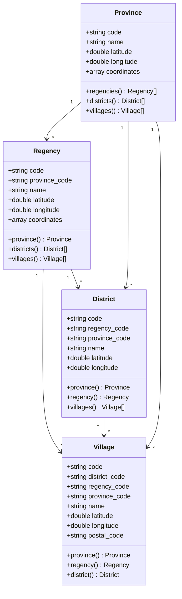

# Database Structure

## `provinces`

| Field | Attribute | Key | Description |
| --- | --- | --- | --- |
| `code` | `char(2)` | `primary` | - |
| `name` | `varchar` | - | - |
| `latitude` | `double`, `nullable` | - | - |
| `longitude` | `double`, `nullable` | - | - |
| `coordinates` | `array`, `nullable` | - | - |

## `regencies`

| Field | Attribute | Key | Description |
| --- | --- | --- | --- |
| `code` | `varchar(5)` | `primary` | Format: `xx.xx` |
| `province_code` | `char(2)` | `foreign` | - |
| `name` | `varchar` | - | - |
| `latitude` | `double`, `nullable` | - | - |
| `longitude` | `double`, `nullable` | - | - |
| `coordinates` | `array`, `nullable` | - | - |

**Relation Properties**
- `province_code` : reference `provinces`

## `districts`

| Field | Attribute | Key | Description |
| --- | --- | --- | --- |
| `code` | `varchar(8)` | `primary` | Format: `xx.xx.xx` |
| `regency_code` | `varchar(5)` | `foreign` | - |
| `province_code` | `char(2)` | `foreign` | - |
| `name` | `varchar` | - | - |
| `latitude` | `double`, `nullable` | - | - |
| `longitude` | `double`, `nullable` | - | - |

**Relation Properties**
- `regency_code` : reference `regencies`
- `province_code` : reference `provinces`

## `villages`

| Field | Attribute | Key | Description |
| --- | --- | --- | --- |
| `code` | `varchar(13)` | `primary` | Format: `xx.xx.xx.xxxx` |
| `district_code` | `varchar(8)` | `foreign` | - |
| `regency_code` | `varchar(5)` | `foreign` | - |
| `province_code` | `char(2)` | `foreign` | - |
| `name` | `varchar` | - | - |
| `latitude` | `double`, `nullable` | - | - |
| `longitude` | `double`, `nullable` | - | - |
| `postal_code` | `varchar(5)`, `nullable` | - | - |

**Relation Properties**
- `district_code` : reference `districts`
- `regency_code` : reference `regencies`
- `province_code` : reference `provinces`
