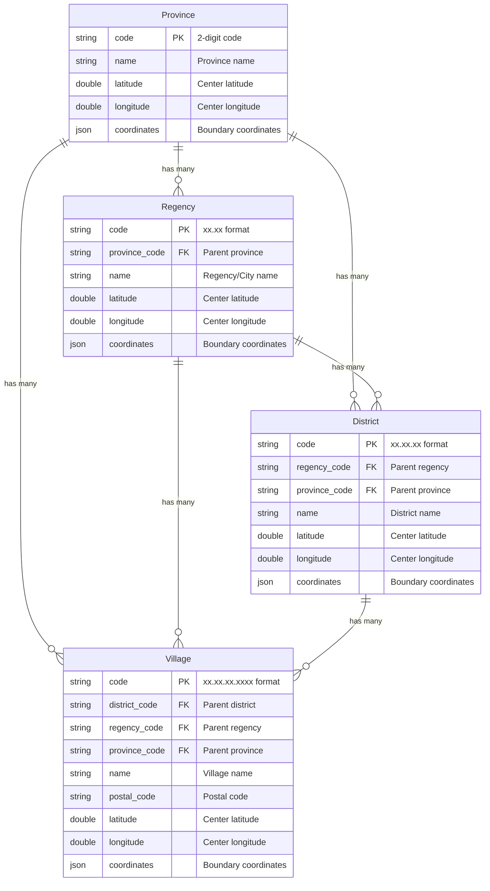

# Models Overview

Laravel Nusa provides a comprehensive set of Eloquent models representing Indonesia's administrative hierarchy. This technical overview covers the database structure, relationships, and implementation details.

## Administrative Hierarchy

The models follow Indonesia's official administrative structure:

```
Province (34 records)
└── Regency (514 records)
    └── District (7,266 records)
        └── Village (83,467 records)
```

## Entity Relationship Diagram



## Database Tables

### Province Table

| Column | Type | Description |
|--------|------|-------------|
| `code` | `string(2)` | Primary key, 2-digit province code |
| `name` | `string` | Official province name |
| `latitude` | `double` | Center point latitude |
| `longitude` | `double` | Center point longitude |
| `coordinates` | `json` | Boundary coordinates array |

**Example codes**: `31` (DKI Jakarta), `33` (Jawa Tengah), `73` (Sulawesi Selatan)

### Regency Table

| Column | Type | Description |
|--------|------|-------------|
| `code` | `string(5)` | Primary key, xx.xx format |
| `province_code` | `string(2)` | Foreign key to provinces |
| `name` | `string` | Official regency/city name |
| `latitude` | `double` | Center point latitude |
| `longitude` | `double` | Center point longitude |
| `coordinates` | `json` | Boundary coordinates array |

**Example codes**: `31.71` (Jakarta Selatan), `33.74` (Semarang), `73.71` (Makassar)

### District Table

| Column | Type | Description |
|--------|------|-------------|
| `code` | `string(8)` | Primary key, xx.xx.xx format |
| `regency_code` | `string(5)` | Foreign key to regencies |
| `province_code` | `string(2)` | Foreign key to provinces |
| `name` | `string` | Official district name |
| `latitude` | `double` | Center point latitude |
| `longitude` | `double` | Center point longitude |
| `coordinates` | `json` | Boundary coordinates array |

**Example codes**: `31.71.01` (Jagakarsa), `33.74.01` (Semarang Tengah)

### Village Table

| Column | Type | Description |
|--------|------|-------------|
| `code` | `string(13)` | Primary key, xx.xx.xx.xxxx format |
| `district_code` | `string(8)` | Foreign key to districts |
| `regency_code` | `string(5)` | Foreign key to regencies |
| `province_code` | `string(2)` | Foreign key to provinces |
| `name` | `string` | Official village name |
| `postal_code` | `string(5)` | Village postal code |
| `latitude` | `double` | Center point latitude |
| `longitude` | `double` | Center point longitude |
| `coordinates` | `json` | Boundary coordinates array |

**Example codes**: `31.71.01.1001` (Jagakarsa), `33.74.01.1001` (Sekayu)

## Code Format Standards

Laravel Nusa uses a hierarchical coding system:

- **Province**: `XX` (2 digits)
- **Regency**: `XX.XX` (province.regency)
- **District**: `XX.XX.XX` (province.regency.district)
- **Village**: `XX.XX.XX.XXXX` (province.regency.district.village)

### Examples:
```
33          → Jawa Tengah (Province)
33.74       → Kota Semarang (Regency)
33.74.01    → Semarang Tengah (District)
33.74.01.1001 → Sekayu (Village)
```

## Database Connection

All models use a separate SQLite database connection named `nusa`:

```php
// Automatic connection configuration
'nusa' => [
    'driver' => 'sqlite',
    'database' => __DIR__.'/../vendor/creasi/laravel-nusa/database/nusa.sqlite',
    'prefix' => '',
    'foreign_key_constraints' => true,
],
```

## Model Relationships

### Hierarchical Relationships

Each model includes both upward (belongs to) and downward (has many) relationships:

```php
// Province Model
public function regencies() // HasMany
public function districts()  // HasMany  
public function villages()   // HasMany

// Regency Model
public function province()   // BelongsTo
public function districts()  // HasMany
public function villages()   // HasMany

// District Model
public function province()   // BelongsTo
public function regency()    // BelongsTo
public function villages()   // HasMany

// Village Model
public function province()   // BelongsTo
public function regency()    // BelongsTo
public function district()   // BelongsTo
```

### Cross-Level Relationships

Models include direct relationships that skip intermediate levels:

```php
// Province can directly access districts and villages
$province->districts; // All districts in province
$province->villages;  // All villages in province

// Regency can directly access villages
$regency->villages;   // All villages in regency
```

## Data Integrity

### Foreign Key Constraints

The database maintains referential integrity through foreign key relationships:

```sql
-- Regency references Province
FOREIGN KEY (province_code) REFERENCES provinces(code)

-- District references both Regency and Province
FOREIGN KEY (regency_code) REFERENCES regencies(code)
FOREIGN KEY (province_code) REFERENCES provinces(code)

-- Village references District, Regency, and Province
FOREIGN KEY (district_code) REFERENCES districts(code)
FOREIGN KEY (regency_code) REFERENCES regencies(code)
FOREIGN KEY (province_code) REFERENCES provinces(code)
```

### Data Validation

Models include automatic validation to ensure code consistency:

```php
// Village codes must match parent hierarchy
$village = Village::find('33.74.01.1001');
assert($village->district_code === '33.74.01');
assert($village->regency_code === '33.74');
assert($village->province_code === '33');
```

## Performance Considerations

### Indexing Strategy

The database includes optimized indexes for common query patterns:

```sql
-- Primary indexes on codes
PRIMARY KEY (code)

-- Foreign key indexes
INDEX idx_regency_province (province_code)
INDEX idx_district_regency (regency_code)
INDEX idx_district_province (province_code)
INDEX idx_village_district (district_code)
INDEX idx_village_regency (regency_code)
INDEX idx_village_province (province_code)
INDEX idx_village_postal (postal_code)
```

### Query Optimization

Use appropriate relationships and eager loading:

```php
// Efficient: Load with relationships
$villages = Village::with(['district.regency.province'])->paginate(50);

// Inefficient: N+1 queries
$villages = Village::all();
foreach ($villages as $village) {
    echo $village->province->name; // N+1 query
}
```

## Data Sources

The database is compiled from official Indonesian government sources:

- **BPS (Badan Pusat Statistik)** - Statistical data and administrative codes
- **Kemendagri (Kementerian Dalam Negeri)** - Administrative region definitions
- **Official regional government data** - Local administrative updates

## Model Documentation

For detailed information about each model:

- **[Province Model](/api/models/province)** - Provincial-level operations and relationships
- **[Regency Model](/api/models/regency)** - City/regency-level functionality
- **[District Model](/api/models/district)** - District-level features and usage
- **[Village Model](/api/models/village)** - Village-level operations and postal codes
- **[Address Model](/api/models/address)** - Address management and polymorphic relationships

## Customization Options

Learn how to extend and customize the models:

- **[Model Concerns](/api/concerns/)** - Reusable traits for your own models
- **[Customization Guide](/guide/customization)** - Integration patterns and examples
