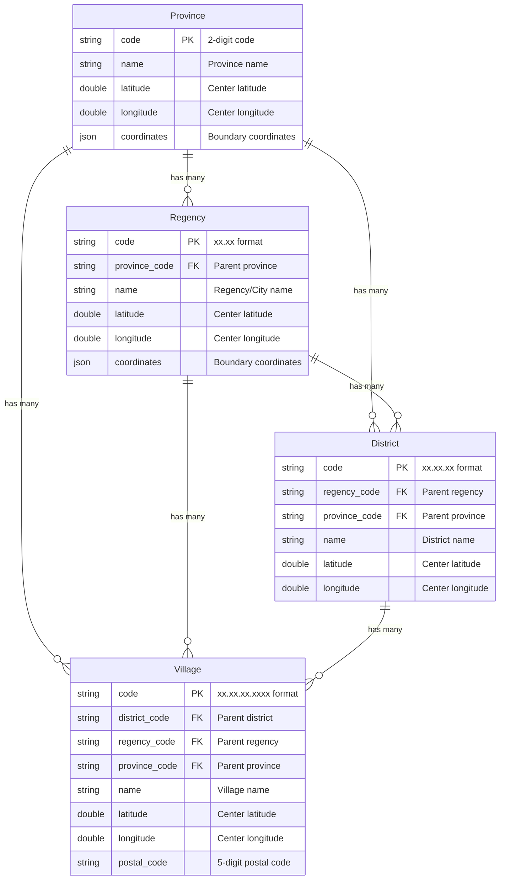

# Database Structure

Laravel Nusa uses a well-designed database schema that reflects the hierarchical structure of Indonesian administrative regions. This page explains the database design, relationships, and how to work with the data effectively.

## Overview

The database contains four main tables representing the administrative hierarchy:

```
Province (34 records)
├── Regency (514 records)
│   ├── District (7,266 records)
│   │   └── Village (83,467 records)
```

## Entity Relationship Diagram



## Table Structures

### Provinces Table

| Column | Type | Attributes | Description |
|--------|------|------------|-------------|
| `code` | `char(2)` | Primary Key | Official 2-digit province code |
| `name` | `varchar(255)` | Not Null | Province name in Indonesian |
| `latitude` | `double` | Nullable | Geographic center latitude |
| `longitude` | `double` | Nullable | Geographic center longitude |
| `coordinates` | `json` | Nullable | Boundary polygon coordinates |

**Example:**
```sql
INSERT INTO provinces VALUES (
    '33',
    'Jawa Tengah',
    -6.9934809206806,
    110.42024335421,
    '[[-6.123, 110.456], [-6.234, 110.567], ...]'
);
```

### Regencies Table

| Column | Type | Attributes | Description |
|--------|------|------------|-------------|
| `code` | `varchar(5)` | Primary Key | Official regency code (xx.xx format) |
| `province_code` | `char(2)` | Foreign Key | Reference to provinces.code |
| `name` | `varchar(255)` | Not Null | Regency/City name |
| `latitude` | `double` | Nullable | Geographic center latitude |
| `longitude` | `double` | Nullable | Geographic center longitude |
| `coordinates` | `json` | Nullable | Boundary polygon coordinates |

**Example:**
```sql
INSERT INTO regencies VALUES (
    '33.75',
    '33',
    'Kota Pekalongan',
    -6.8969497174987,
    109.66208089654,
    '[[-6.789, 109.567], [-6.890, 109.678], ...]'
);
```

### Districts Table

| Column | Type | Attributes | Description |
|--------|------|------------|-------------|
| `code` | `varchar(8)` | Primary Key | Official district code (xx.xx.xx format) |
| `regency_code` | `varchar(5)` | Foreign Key | Reference to regencies.code |
| `province_code` | `char(2)` | Foreign Key | Reference to provinces.code |
| `name` | `varchar(255)` | Not Null | District name |
| `latitude` | `double` | Nullable | Geographic center latitude |
| `longitude` | `double` | Nullable | Geographic center longitude |

**Example:**
```sql
INSERT INTO districts VALUES (
    '33.75.01',
    '33.75',
    '33',
    'Pekalongan Barat',
    -6.8969497174987,
    109.66208089654
);
```

### Villages Table

| Column | Type | Attributes | Description |
|--------|------|------------|-------------|
| `code` | `varchar(13)` | Primary Key | Official village code (xx.xx.xx.xxxx format) |
| `district_code` | `varchar(8)` | Foreign Key | Reference to districts.code |
| `regency_code` | `varchar(5)` | Foreign Key | Reference to regencies.code |
| `province_code` | `char(2)` | Foreign Key | Reference to provinces.code |
| `name` | `varchar(255)` | Not Null | Village name |
| `latitude` | `double` | Nullable | Geographic center latitude |
| `longitude` | `double` | Nullable | Geographic center longitude |
| `postal_code` | `varchar(5)` | Nullable | 5-digit postal code |

**Example:**
```sql
INSERT INTO villages VALUES (
    '33.75.01.1002',
    '33.75.01',
    '33.75',
    '33',
    'Medono',
    -6.8969497174987,
    109.66208089654,
    '51111'
);
```

## Code Structure

### Administrative Codes

Indonesian administrative codes follow a hierarchical pattern with dot notation:

```
Province:  XX
Regency:   XX.YY
District:  XX.YY.ZZ
Village:   XX.YY.ZZ.VVVV

Where:
- XX = Province code (2 digits)
- YY = Regency code within province (2 digits)
- ZZ = District code within regency (2 digits)
- VVVV = Village code within district (4 digits)
```

**Examples:**
- Province: `33` (Central Java)
- Regency: `33.75` (Pekalongan City in Central Java)
- District: `33.75.01` (West Pekalongan in Pekalongan City)
- Village: `33.75.01.1002` (Medono Village in West Pekalongan)

### Postal Codes

Postal codes are 5-digit numbers assigned to villages:

```
Postal Code: ABCDE

Where:
- A = Major region (1-9)
- B = Sub-region (0-9)
- C = Delivery area (0-9)
- DE = Specific location (00-99)
```

## Database Connections

### Default Configuration

Laravel Nusa automatically configures a SQLite connection:

```php
// Automatically added to config/database.php
'nusa' => [
    'driver' => 'sqlite',
    'database' => '/path/to/vendor/creasi/laravel-nusa/database/nusa.sqlite',
    'foreign_key_constraints' => true,
],
```

### Custom Connections

You can use different database drivers:

```php
// MySQL example
'nusa_mysql' => [
    'driver' => 'mysql',
    'host' => env('NUSA_DB_HOST', '127.0.0.1'),
    'database' => env('NUSA_DB_DATABASE', 'indonesia'),
    'username' => env('NUSA_DB_USERNAME', 'root'),
    'password' => env('NUSA_DB_PASSWORD', ''),
    'charset' => 'utf8mb4',
    'collation' => 'utf8mb4_unicode_ci',
],

// PostgreSQL example
'nusa_pgsql' => [
    'driver' => 'pgsql',
    'host' => env('NUSA_DB_HOST', '127.0.0.1'),
    'database' => env('NUSA_DB_DATABASE', 'indonesia'),
    'username' => env('NUSA_DB_USERNAME', 'postgres'),
    'password' => env('NUSA_DB_PASSWORD', ''),
    'charset' => 'utf8',
    'schema' => 'public',
],
```

## Indexes and Performance

### Primary Keys

All tables use string primary keys based on official codes:

```sql
-- Optimized for lookups by code
CREATE INDEX idx_provinces_code ON provinces(code);
CREATE INDEX idx_regencies_code ON regencies(code);
CREATE INDEX idx_districts_code ON districts(code);
CREATE INDEX idx_villages_code ON villages(code);
```

### Foreign Key Indexes

Foreign key relationships are indexed for efficient joins:

```sql
-- Hierarchical lookups
CREATE INDEX idx_regencies_province ON regencies(province_code);
CREATE INDEX idx_districts_regency ON districts(regency_code);
CREATE INDEX idx_districts_province ON districts(province_code);
CREATE INDEX idx_villages_district ON villages(district_code);
CREATE INDEX idx_villages_regency ON villages(regency_code);
CREATE INDEX idx_villages_province ON villages(province_code);
```

### Search Indexes

Text search is optimized for name lookups:

```sql
-- Name-based searches
CREATE INDEX idx_provinces_name ON provinces(name);
CREATE INDEX idx_regencies_name ON regencies(name);
CREATE INDEX idx_districts_name ON districts(name);
CREATE INDEX idx_villages_name ON villages(name);

-- Postal code lookups
CREATE INDEX idx_villages_postal ON villages(postal_code);
```

## Data Integrity

### Foreign Key Constraints

The database enforces referential integrity:

```sql
-- Regencies must belong to valid provinces
ALTER TABLE regencies 
ADD CONSTRAINT fk_regencies_province 
FOREIGN KEY (province_code) REFERENCES provinces(code);

-- Districts must belong to valid regencies and provinces
ALTER TABLE districts 
ADD CONSTRAINT fk_districts_regency 
FOREIGN KEY (regency_code) REFERENCES regencies(code);

ALTER TABLE districts 
ADD CONSTRAINT fk_districts_province 
FOREIGN KEY (province_code) REFERENCES provinces(code);

-- Villages must belong to valid districts, regencies, and provinces
ALTER TABLE villages 
ADD CONSTRAINT fk_villages_district 
FOREIGN KEY (district_code) REFERENCES districts(code);

ALTER TABLE villages 
ADD CONSTRAINT fk_villages_regency 
FOREIGN KEY (regency_code) REFERENCES regencies(code);

ALTER TABLE villages 
ADD CONSTRAINT fk_villages_province 
FOREIGN KEY (province_code) REFERENCES provinces(code);
```

### Data Validation

Additional constraints ensure data quality:

```sql
-- Code format validation
ALTER TABLE provinces ADD CONSTRAINT chk_province_code 
CHECK (LENGTH(code) = 2 AND code GLOB '[0-9][0-9]');

ALTER TABLE regencies ADD CONSTRAINT chk_regency_code 
CHECK (LENGTH(code) = 4 AND code GLOB '[0-9][0-9][0-9][0-9]');

ALTER TABLE districts ADD CONSTRAINT chk_district_code 
CHECK (LENGTH(code) = 6 AND code GLOB '[0-9][0-9][0-9][0-9][0-9][0-9]');

ALTER TABLE villages ADD CONSTRAINT chk_village_code 
CHECK (LENGTH(code) = 10 AND code GLOB '[0-9][0-9][0-9][0-9][0-9][0-9][0-9][0-9][0-9][0-9]');

-- Postal code format
ALTER TABLE villages ADD CONSTRAINT chk_postal_code 
CHECK (postal_code IS NULL OR (LENGTH(postal_code) = 5 AND postal_code GLOB '[0-9][0-9][0-9][0-9][0-9]'));
```

## Query Patterns

### Common Queries

```sql
-- Get all provinces
SELECT code, name FROM provinces ORDER BY name;

-- Get regencies in a province
SELECT code, name FROM regencies
WHERE province_code = '33' ORDER BY name;

-- Get full address hierarchy for a village
SELECT 
    v.name as village,
    d.name as district,
    r.name as regency,
    p.name as province,
    v.postal_code
FROM villages v
JOIN districts d ON v.district_code = d.code
JOIN regencies r ON v.regency_code = r.code
JOIN provinces p ON v.province_code = p.code
WHERE v.code = '33.75.01.1002';

-- Search by name (case-insensitive)
SELECT code, name FROM provinces 
WHERE name LIKE '%jawa%' COLLATE NOCASE;

-- Get postal codes in a province
SELECT DISTINCT postal_code FROM villages 
WHERE province_code = '33' AND postal_code IS NOT NULL
ORDER BY postal_code;
```

### Performance Optimization

```sql
-- Use EXPLAIN QUERY PLAN to analyze queries
EXPLAIN QUERY PLAN 
SELECT * FROM villages WHERE district_code = '33.75.01';

-- Efficient pagination
SELECT code, name FROM villages 
WHERE district_code = '337501'
ORDER BY name
LIMIT 50 OFFSET 100;

-- Count with indexes
SELECT COUNT(*) FROM villages WHERE province_code = '33';
```

## Database Maintenance

### Statistics and Analysis

```sql
-- Table sizes
SELECT 
    name,
    COUNT(*) as record_count
FROM (
    SELECT 'provinces' as name, COUNT(*) as count FROM provinces
    UNION ALL
    SELECT 'regencies', COUNT(*) FROM regencies
    UNION ALL
    SELECT 'districts', COUNT(*) FROM districts
    UNION ALL
    SELECT 'villages', COUNT(*) FROM villages
);

-- Data distribution
SELECT 
    province_code,
    COUNT(*) as village_count
FROM villages 
GROUP BY province_code 
ORDER BY village_count DESC;
```

### Backup and Recovery

```bash
# SQLite backup
sqlite3 database/nusa.sqlite ".backup backup.sqlite"

# Export to SQL
sqlite3 database/nusa.sqlite ".dump" > nusa_backup.sql

# Import from SQL
sqlite3 new_database.sqlite < nusa_backup.sql
```

This database structure provides a solid foundation for Indonesian administrative data with proper relationships, indexes, and constraints to ensure data integrity and performance.
