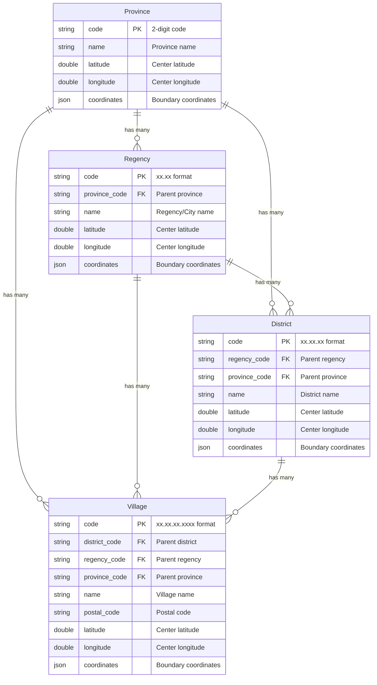

# Ikhtisar Model

Laravel Nusa menyediakan seperangkat model Eloquent komprehensif yang merepresentasikan hierarki administratif Indonesia. Ikhtisar teknis ini mencakup struktur database, relasi, dan detail implementasi.

## Hierarki Administratif

Model-model ini mengikuti struktur administratif resmi Indonesia:

```
Province (34 records)
└── Regency (514 records)
    └── District (7,285 records)
        └── Village (83,762 records)
```

## Diagram Relasi Entitas



## Tabel Database

### Tabel Provinsi

| Kolom | Tipe | Deskripsi |
|--------|------|-------------|
| `code` | `string(2)` | Kunci utama, kode provinsi 2 digit |
| `name` | `string` | Nama provinsi resmi |
| `latitude` | `double` | Lintang titik pusat |
| `longitude` | `double` | Bujur titik pusat |
| `coordinates` | `json` | Array koordinat batas |

**Contoh kode**: `31` (DKI Jakarta), `33` (Jawa Tengah), `73` (Sulawesi Selatan)

### Tabel Kabupaten/Kota

| Kolom | Tipe | Deskripsi |
|--------|------|-------------|
| `code` | `string(5)` | Kunci utama, format xx.xx |
| `province_code` | `string(2)` | Kunci asing ke provinsi |
| `name` | `string` | Nama resmi kabupaten/kota |
| `latitude` | `double` | Lintang titik pusat |
| `longitude` | `double` | Bujur titik pusat |
| `coordinates` | `json` | Array koordinat batas |

**Contoh kode**: `31.71` (Jakarta Selatan), `33.74` (Semarang), `73.71` (Makassar)

### Tabel Kecamatan

| Kolom | Tipe | Deskripsi |
|--------|------|-------------|
| `code` | `string(8)` | Kunci utama, format xx.xx.xx |
| `regency_code` | `string(5)` | Kunci asing ke kabupaten/kota |
| `province_code` | `string(2)` | Kunci asing ke provinsi |
| `name` | `string` | Nama resmi kecamatan |
| `latitude` | `double` | Lintang titik pusat |
| `longitude` | `double` | Bujur titik pusat |
| `coordinates` | `json` | Array koordinat batas |

**Contoh kode**: `31.71.01` (Jagakarsa), `33.74.01` (Semarang Tengah)

### Tabel Desa/Kelurahan

| Kolom | Tipe | Deskripsi |
|--------|------|-------------|
| `code` | `string(13)` | Kunci utama, format xx.xx.xx.xxxx |
| `district_code` | `string(8)` | Kunci asing ke kecamatan |
| `regency_code` | `string(5)` | Kunci asing ke kabupaten/kota |
| `province_code` | `string(2)` | Kunci asing ke provinsi |
| `name` | `string` | Nama resmi desa/kelurahan |
| `postal_code` | `string(5)` | Kode pos desa/kelurahan |
| `latitude` | `double` | Lintang titik pusat |
| `longitude` | `double` | Bujur titik pusat |
| `coordinates` | `json` | Array koordinat batas |

**Contoh kode**: `31.71.01.1001` (Jagakarsa), `33.74.01.1001` (Sekayu)

## Standar Format Kode

Laravel Nusa menggunakan sistem pengkodean hierarkis:

- **Provinsi**: `XX` (2 digit)
- **Kabupaten/Kota**: `XX.XX` (provinsi.kabupaten/kota)
- **Kecamatan**: `XX.XX.XX` (provinsi.kabupaten/kota.kecamatan)
- **Desa/Kelurahan**: `XX.XX.XX.XXXX` (provinsi.kabupaten/kota.kecamatan.desa/kelurahan)

### Contoh:
```
33          → Jawa Tengah (Provinsi)
33.74       → Kota Semarang (Kabupaten/Kota)
33.74.01    → Semarang Tengah (Kecamatan)
33.74.01.1001 → Sekayu (Desa/Kelurahan)
```

## Koneksi Database

Semua model menggunakan koneksi database SQLite terpisah bernama `nusa`:

```php
// Konfigurasi koneksi otomatis
'nusa' => [
    'driver' => 'sqlite',
    'database' => __DIR__.'/../vendor/creasi/laravel-nusa/database/nusa.sqlite',
    'prefix' => '',
    'foreign_key_constraints' => true,
],
```

## Relasi Model

### Relasi Hierarkis

Setiap model mencakup relasi ke atas (belongs to) dan ke bawah (has many):

```php
// Model Provinsi
public function regencies() // HasMany
public function districts()  // HasMany  
public function villages()   // HasMany

// Model Kabupaten/Kota
public function province()   // BelongsTo
public function districts()  // HasMany
public function villages()   // HasMany

// Model Kecamatan
public function province()   // BelongsTo
public function regency()    // BelongsTo
public function villages()   // HasMany

// Model Desa/Kelurahan
public function province()   // BelongsTo
public function regency()    // BelongsTo
public function district()   // BelongsTo
```

### Relasi Lintas Tingkat

Model-model ini mencakup relasi langsung yang melewati tingkat menengah:

```php
// Provinsi dapat langsung mengakses kecamatan dan desa/kelurahan
$province->districts; // Semua kecamatan di provinsi
$province->villages;  // Semua desa/kelurahan di provinsi

// Kabupaten/Kota dapat langsung mengakses desa/kelurahan
$regency->villages;   // Semua desa/kelurahan di kabupaten/kota
```

## Integritas Data

### Kendala Kunci Asing

Database menjaga integritas referensial melalui relasi kunci asing:

```sql
-- Kabupaten/Kota mereferensikan Provinsi
FOREIGN KEY (province_code) REFERENCES provinces(code)

-- Kecamatan mereferensikan Kabupaten/Kota dan Provinsi
FOREIGN KEY (regency_code) REFERENCES regencies(code)
FOREIGN KEY (province_code) REFERENCES provinces(code)

-- Desa/Kelurahan mereferensikan Kecamatan, Kabupaten/Kota, dan Provinsi
FOREIGN KEY (district_code) REFERENCES districts(code)
FOREIGN KEY (regency_code) REFERENCES regencies(code)
FOREIGN KEY (province_code) REFERENCES provinces(code)
```

### Validasi Data

Model-model ini mencakup validasi otomatis untuk memastikan konsistensi kode:

```php
// Kode desa/kelurahan harus sesuai dengan hierarki induk
$village = Village::find('33.74.01.1001');
assert($village->district_code === '33.74.01');
assert($village->regency_code === '33.74');
assert($village->province_code === '33');
```

## Pertimbangan Kinerja

### Strategi Pengindeksan

Database mencakup indeks yang dioptimalkan untuk pola kueri umum:

```sql
-- Indeks utama pada kode
PRIMARY KEY (code)

-- Indeks kunci asing
INDEX idx_regency_province (province_code)
INDEX idx_district_regency (regency_code)
INDEX idx_district_province (province_code)
INDEX idx_village_district (district_code)
INDEX idx_village_regency (regency_code)
INDEX idx_village_province (province_code)
INDEX idx_village_postal (postal_code)
```

### Optimasi Kueri

Gunakan relasi yang sesuai dan *eager loading*:

```php
// Efisien: Muat dengan relasi
$villages = Village::with(['district.regency.province'])->paginate(50);

// Tidak efisien: Kueri N+1
$villages = Village::all();
foreach ($villages as $village) {
    echo $village->province->name; // Kueri N+1
}
```

## Sumber Data

Database ini dikompilasi dari sumber resmi pemerintah Indonesia:

- **BPS (Badan Pusat Statistik)** - Data statistik dan kode administratif
- **Kemendagri (Kementerian Dalam Negeri)** - Definisi wilayah administratif
- **Data pemerintah daerah resmi** - Pembaruan administratif lokal

## Dokumentasi Model

Untuk informasi rinci tentang setiap model:

- **[Model Province](/id/api/models/province)** - Operasi dan relasi tingkat provinsi
- **[Model Regency](/id/api/models/regency)** - Fungsionalitas tingkat kabupaten/kota
- **[Model District](/id/api/models/district)** - Fitur dan penggunaan tingkat kecamatan
- **[Model Village](/id/api/models/village)** - Operasi dan kode pos tingkat desa/kelurahan
- **[Model Address](/id/api/models/address)** - Manajemen alamat dan relasi polimorfik

## Opsi Kustomisasi

Pelajari cara memperluas dan menyesuaikan model:

- **[Concern Model](/id/api/concerns/)** - Trait yang dapat digunakan kembali untuk model Anda sendiri
- **[Panduan Kustomisasi](/id/guide/customization)** - Pola dan contoh integrasi